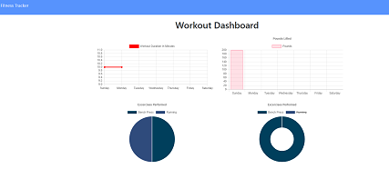

# Workout Tracker

   [](#License)

   ## Description
   This app will let you add and track various exercises during your workout. The total duration, weight lifted, distance covered, set/reps performed, and total exercises performed will show up on the main page once an exercise has been added. You can also check a stats dashboard that will show this information in various charts.

   ## Table of Contents
   * [Installation](#Installation)
   * [Usage](#Usage)
   * [License](#License)
   * [Tests](#Tests)
   * [Questions](#Questions)
   
   ## Installation
   To install, please run the following code in the terminal:

   ```
   npm install
   ```

   You will also need to have MongoDB installed on your computer. This readme does not walkthrough the steps to do that, so you will have to look elsewhere online for that information. I am using Robo3T for the database application, but you may use the MongoDB application of your choosing.

   ## Usage
   To use this app, run the following command in the terminal:

   ```
   node server.js
   ```

   This is not a necessary step, but you can pre-fillout the database by using the following command in the terminal:

   ```
   npm seed
   ```

   ## License
   The license associated with this project is MIT.
   To view the license information, visit the link [here](https://github.com/CalebParris/Workout-Tracker/blob/master/LICENSE)

   ## Tests
   To test the app, follow the directions from the Installation and Usage sections first. After that, you can use the app as follows:

   First start a new workout.

   
   
   Then choose whether or not to do a Resistance exercise or a Cardio exercise. Fill out the fields with you desired exercise information. Once that is done click either "Add Exercise" to add another exercise of your choice, or "Complete Workout" to finish the workout and be sent back to the Fitness Tracker page to see the totals of all the exercises that have been added.

   
   
   
   You can also click the "Dashboard" at the top of the page to be taken to some charts that show how much time you are spending on each workout as well as how mny pounds you are lifting.

   


   To see the deployed finished product, you can visit this link:
   
   [https://afternoon-gorge-33511.herokuapp.com/](https://afternoon-gorge-33511.herokuapp.com/)

   ## Questions
   If you have any comments, questions, or concerns about this project, please post them [here](https://github.com/CalebParris/Workout-Tracker/issues) and I will respond as soon as I am able.

   Otherwise, you can contact me through the following means:
   * Email: calebparris@live.com
   * Github: [CalebParris](https://github.com/CalebParris)
    
